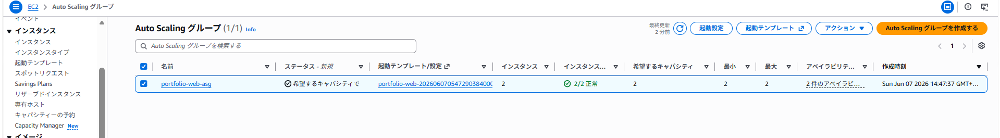
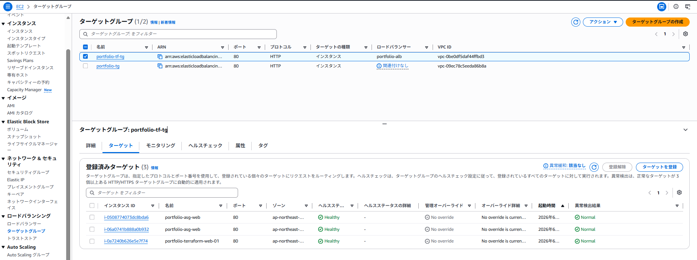
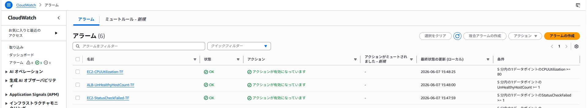
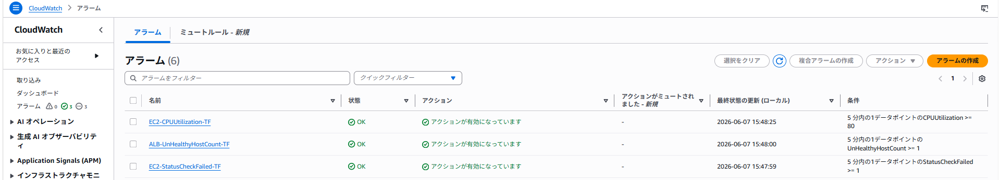

# AWS Terraform Portfolio

## 概要

Terraformを利用してAWS環境をコードで構築したポートフォリオです。

Infrastructure as Code（IaC）の学習を目的として、VPCからEC2、ALB、Auto Scaling Group、CloudWatch監視まで構築しました。

---

## 構成図

Internet

↓

Application Load Balancer (ALB)

↓

Target Group

↓

Auto Scaling Group (ASG)

↓

EC2 (Amazon Linux 2023 + nginx)

---

## 使用サービス

* Terraform

* Amazon VPC

* Subnet

* Route Table

* Internet Gateway

* Security Group

* IAM Role

* IAM Instance Profile

* Amazon EC2

* AWS Systems Manager Session Manager

* Application Load Balancer (ALB)

* Target Group

* Listener

* Launch Template

* Auto Scaling Group

* Amazon CloudWatch

* Amazon SNS

---

## 主な実装内容

### ネットワーク

* VPC作成

* パブリックサブネット作成

* Route Table設定

* Internet Gateway設定

### サーバ

* Amazon Linux 2023 EC2構築

* nginxインストール

* Session Manager接続

### 負荷分散

* ALB構築

* Target Group構築

* Listener設定

* nginx疎通確認

### Auto Scaling

* Launch Template構築

* Auto Scaling Group構築

* EC2自動作成

### 監視

* EC2 CPU監視

* EC2 Status Check監視

* ALB UnHealthyHostCount監視

* SNS通知設定

---

## 学習したこと

* TerraformによるAWS構築

* Session Managerによる安全な接続

* ALBとTarget Groupの仕組み

* Auto Scaling Groupの動作

* UserDataによる自動構成

* CloudWatch Alarmによる監視

---

## 工夫したポイント

- Terraformを利用してAWS環境をコードで構築
- Session Managerを利用しSSH不要で接続可能な構成を実装
- Auto Scaling GroupによりEC2を自動管理
- CloudWatch Alarmによる監視を実装

---

## スクリーンショット

### Auto Scaling Group

Terraformで作成したAuto Scaling Group。
最小2台のEC2インスタンスを維持する設定とし、可用性を考慮した構成を実装。

---

### Target Group

ALB配下のTarget Group。
Auto Scaling Groupで作成されたEC2インスタンスを登録し、ヘルスチェックによって正常稼働（Healthy）であることを確認。

---

### CloudWatch Alarm

Terraformで作成したCloudWatchアラーム。
EC2のCPU使用率、Status Check、ALBのUnHealthyHostCountを監視し、障害の早期検知ができる構成を実装。

---

### nginx動作確認

ALB経由でnginxへアクセスし、正常に疎通できることを確認。
ロードバランサー配下のWebサーバへアクセスできることを検証。

\---

### SNS通知設定

CloudWatch AlarmのアクションとしてSNS通知を設定。
EC2のCPU使用率、Status Check、ALBの異常を検知した際に通知を送信できる構成を実装。

